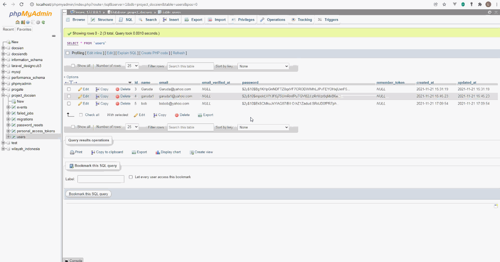
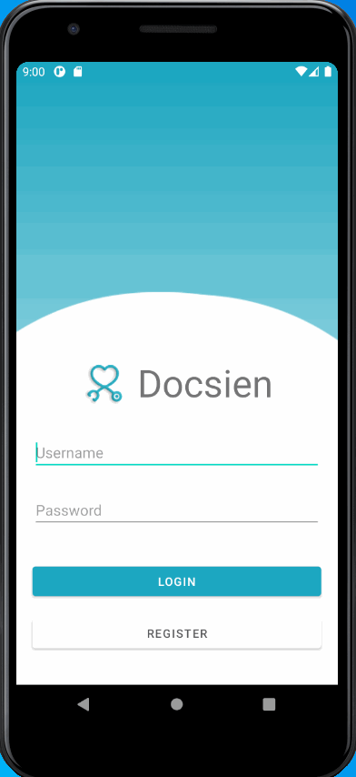

# Docsien

**Docsien** is a medical web portal and mobile application that helps doctors and patients keep track of patient medications for GarudaHacks 2021.

https://devpost.com/software/docsien

## Video Walkthrough

### Web Portal

### Mobile Application

GIF created with [LiceCap](http://www.cockos.com/licecap/).

## Notes / Future Implementations

* [ ] Automatically change marker to red, if patient misses a medication
* [ ] Create RecyclerView for medication
* [ ] Get medication data from Firebase
* [ ] Sign out button
